# Benchmark

Auto-generated by `scripts/benchmark.py` (1000 sims/cell). Re-run with
`uv run python scripts/benchmark.py --n-sims 5000` for tighter Wilson bands.

Each cell is the rejection rate at α = 0.05 over 1000 Monte Carlo iterations.
The `none` column is the FPR (should ≈ 0.05); the others are power at the
labelled effect sizes. Numbers below come from the on-checkout run; CI
re-runs them on every push.

## Headlines

- **Continuous + covariate** (`continuous_*`): CUPED and post-stratification
  visibly beat Welch at small/medium effects (e.g. n=1000, small effect:
  Welch 0.19 → CUPED 0.26 → post-strat 0.25).
- **Paired data** (`paired_*`): paired t-test recovers calibration where
  Welch becomes overly conservative (FPR drops to ≈0.01 because Welch
  ignores the within-pair correlation). Power matches CUPED.
- **Ratio metrics** (`ratio_*`): delta-method and linearization are
  empirically indistinguishable (as theory predicts). Both clearly beat a
  naive Welch on per-user ratios.
- **Binary**: z-proportion and Welch produce essentially identical results
  on Bernoulli outcomes — Welch's overhead disappears at scale.

## binary_n1000

| criterion | none | small | medium | large |
|---|---|---|---|---|
| welch | 0.0620 | 0.0680 | 0.1190 | 0.3120 |
| z_proportion | 0.0620 | 0.0680 | 0.1190 | 0.3120 |

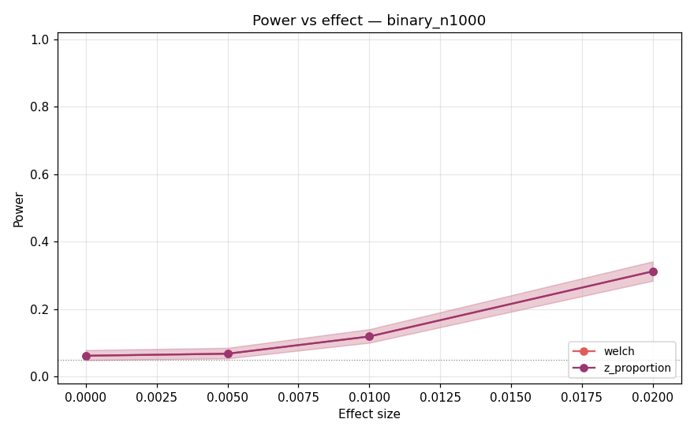

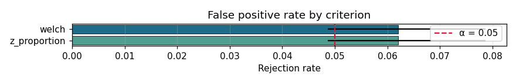

## binary_n20000

| criterion | none | small | medium | large |
|---|---|---|---|---|
| welch | 0.0390 | 0.3800 | 0.8990 | 1.0000 |
| z_proportion | 0.0390 | 0.3800 | 0.8990 | 1.0000 |

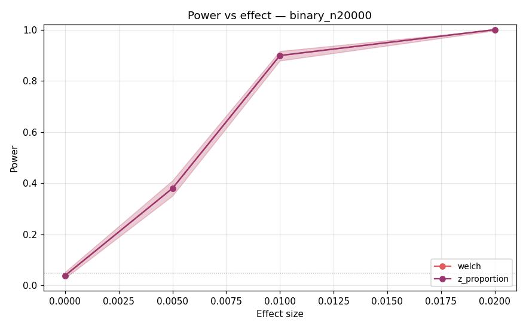

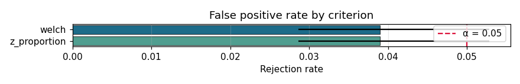

## binary_n5000

| criterion | none | small | medium | large |
|---|---|---|---|---|
| welch | 0.0580 | 0.1540 | 0.3840 | 0.8960 |
| z_proportion | 0.0580 | 0.1540 | 0.3840 | 0.8960 |

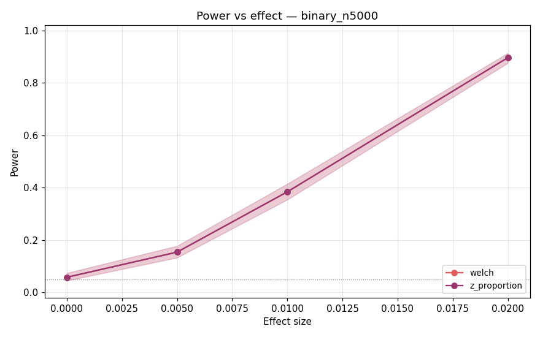

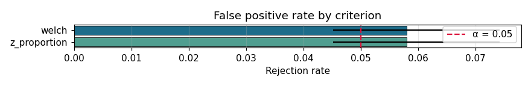

## continuous_n1000

| criterion | none | small | medium | large |
|---|---|---|---|---|
| bootstrap | 0.0420 | 0.2040 | 0.5960 | 0.9970 |
| cuped | 0.0480 | 0.2640 | 0.8000 | 1.0000 |
| post_strat | 0.0530 | 0.2510 | 0.7720 | 1.0000 |
| welch | 0.0440 | 0.1910 | 0.6000 | 0.9980 |

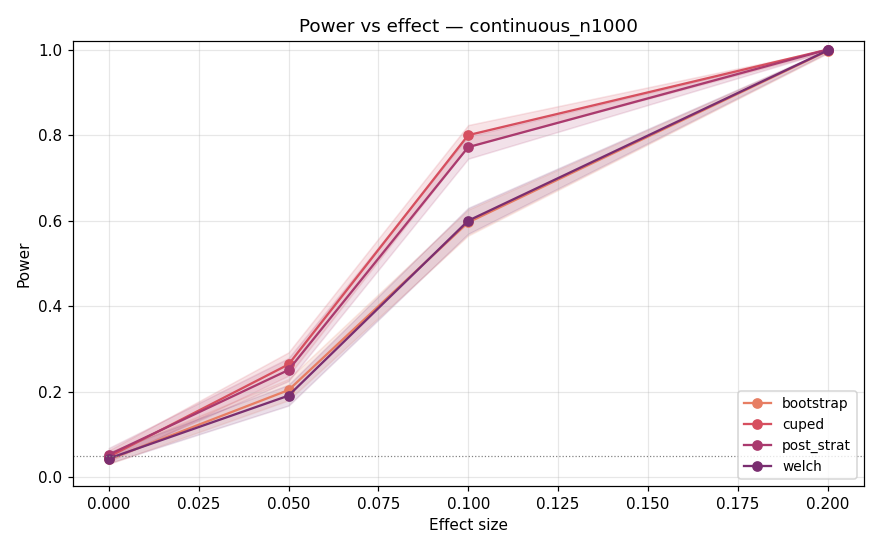

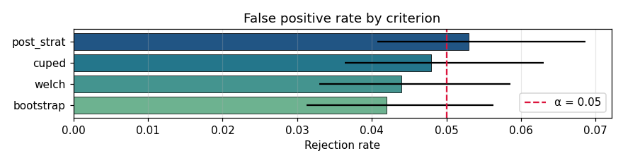

## continuous_n20000

| criterion | none | small | medium | large |
|---|---|---|---|---|
| bootstrap | 0.0580 | 0.9980 | 1.0000 | 1.0000 |
| cuped | 0.0490 | 1.0000 | 1.0000 | 1.0000 |
| post_strat | 0.0470 | 1.0000 | 1.0000 | 1.0000 |
| welch | 0.0550 | 0.9980 | 1.0000 | 1.0000 |

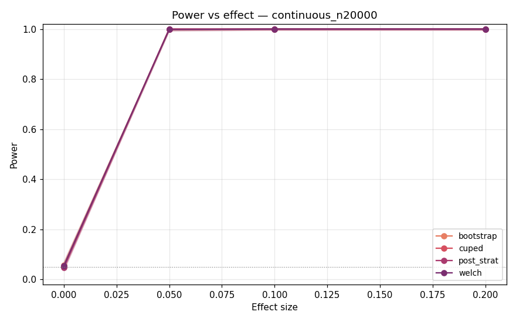

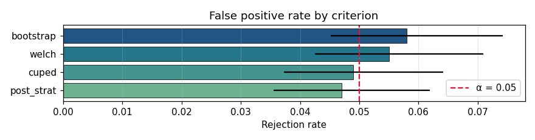

## continuous_n5000

| criterion | none | small | medium | large |
|---|---|---|---|---|
| bootstrap | 0.0560 | 0.6950 | 1.0000 | 1.0000 |
| cuped | 0.0470 | 0.8620 | 1.0000 | 1.0000 |
| post_strat | 0.0530 | 0.8340 | 1.0000 | 1.0000 |
| welch | 0.0490 | 0.6940 | 1.0000 | 1.0000 |

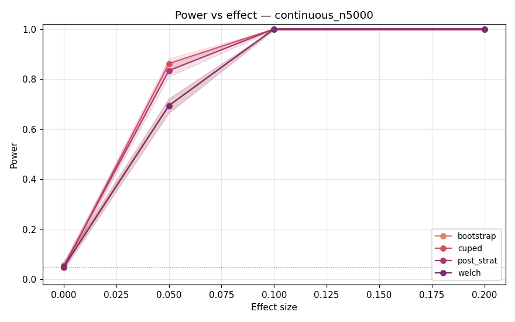

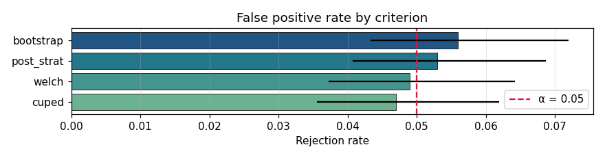

## paired_n1000

| criterion | none | small | medium | large |
|---|---|---|---|---|
| cuped | 0.0410 | 0.2730 | 0.8000 | 1.0000 |
| paired | 0.0400 | 0.2760 | 0.7980 | 1.0000 |
| welch | 0.0110 | 0.1420 | 0.6200 | 1.0000 |

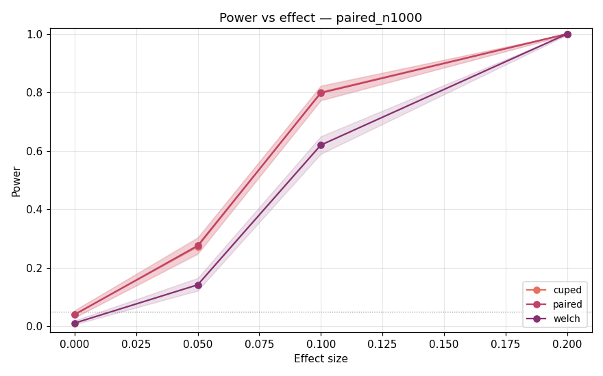

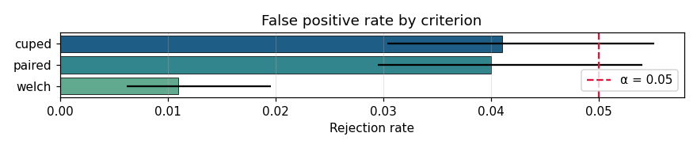

## paired_n20000

| criterion | none | small | medium | large |
|---|---|---|---|---|
| cuped | 0.0430 | 1.0000 | 1.0000 | 1.0000 |
| paired | 0.0440 | 1.0000 | 1.0000 | 1.0000 |
| welch | 0.0180 | 1.0000 | 1.0000 | 1.0000 |

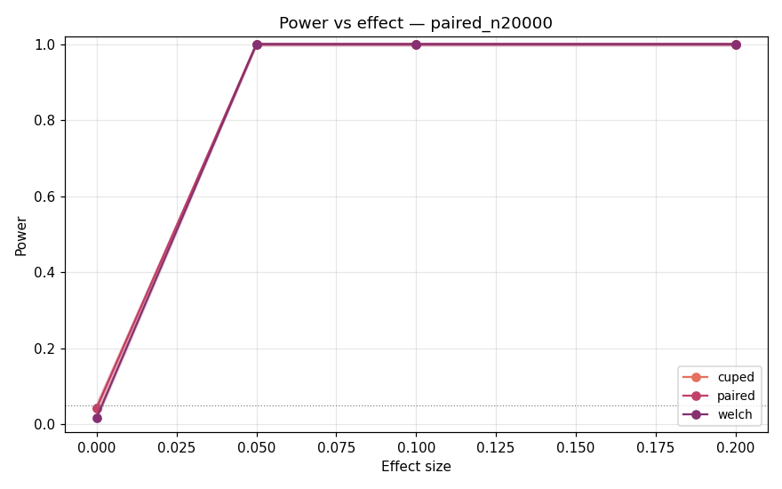

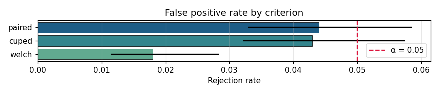

## paired_n5000

| criterion | none | small | medium | large |
|---|---|---|---|---|
| cuped | 0.0550 | 0.8710 | 1.0000 | 1.0000 |
| paired | 0.0550 | 0.8710 | 1.0000 | 1.0000 |
| welch | 0.0160 | 0.7410 | 1.0000 | 1.0000 |

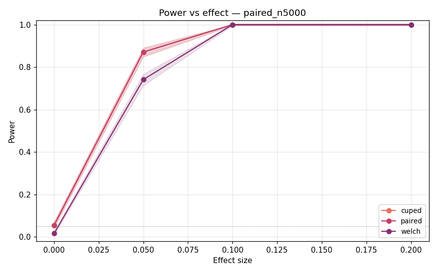

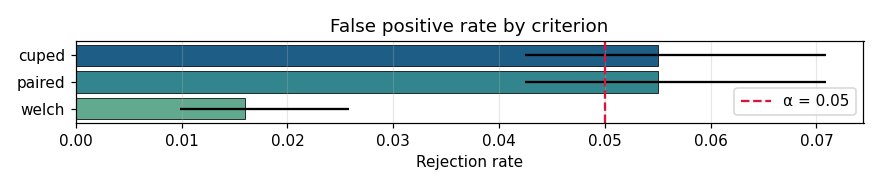

## ratio_n1000

| criterion | none | small | medium | large |
|---|---|---|---|---|
| delta | 0.0520 | 0.0720 | 0.1940 | 0.5780 |
| linearization | 0.0520 | 0.0720 | 0.1930 | 0.5780 |
| welch_naive | 0.0480 | 0.0550 | 0.1730 | 0.4750 |

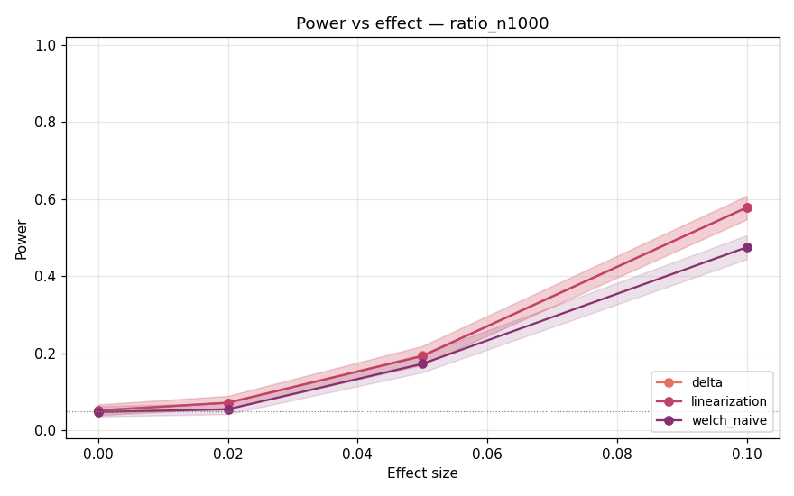

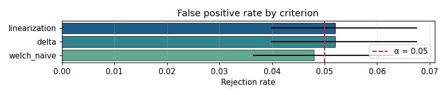

## ratio_n20000

| criterion | none | small | medium | large |
|---|---|---|---|---|
| delta | 0.0490 | 0.4870 | 0.9980 | 1.0000 |
| linearization | 0.0490 | 0.4870 | 0.9980 | 1.0000 |
| welch_naive | 0.0530 | 0.3840 | 0.9900 | 1.0000 |

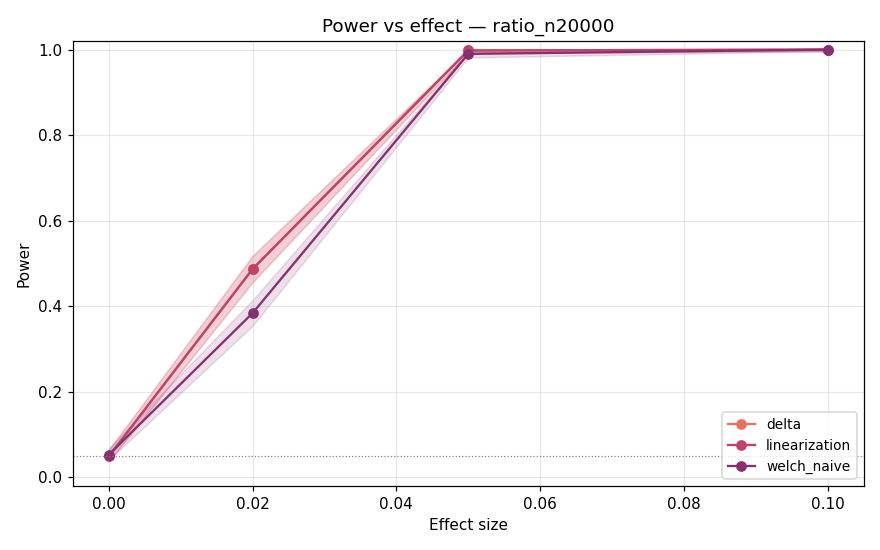

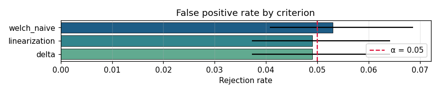

## ratio_n5000

| criterion | none | small | medium | large |
|---|---|---|---|---|
| delta | 0.0500 | 0.1560 | 0.6970 | 0.9990 |
| linearization | 0.0500 | 0.1560 | 0.6970 | 0.9990 |
| welch_naive | 0.0420 | 0.1210 | 0.6000 | 0.9900 |

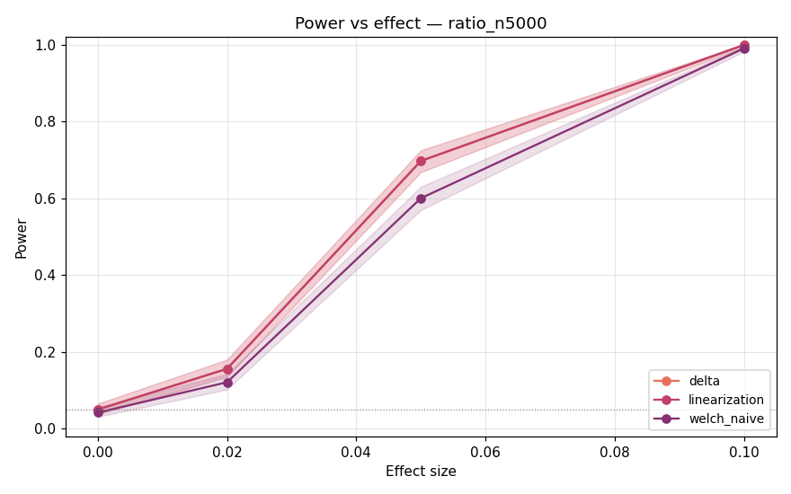

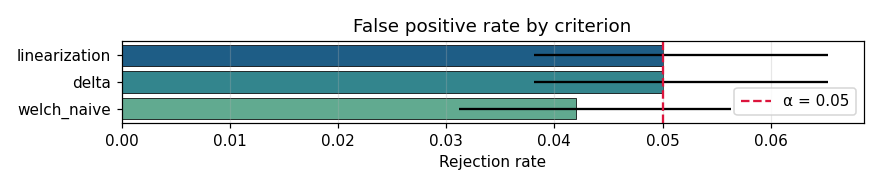
